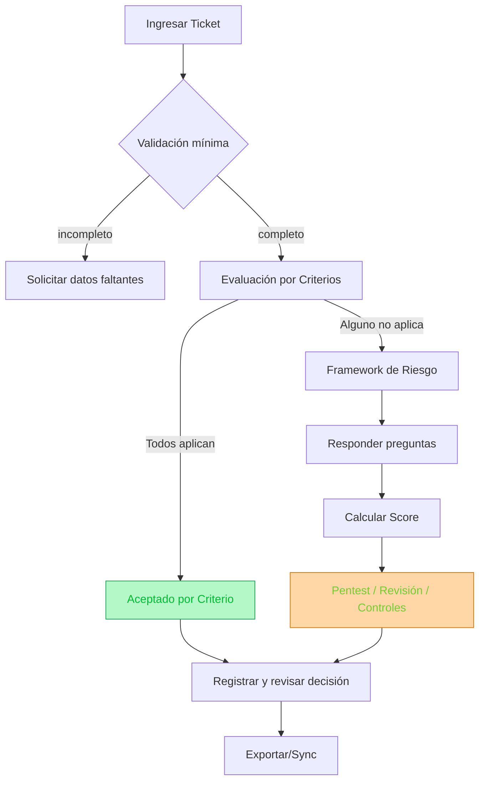

# Security Hub (SRO – Security Risk Orchestration)

MVP para orquestar decisiones de riesgo de seguridad: criterios rápidos, framework de riesgo, notas y exportación a Jira. Incluye persistencia local por ticket, deep-links, capa de servicios y tests.


## 🚀 Despliegue

### Requisitos

* **Node.js** ≥ 18
* **pnpm** (recomendado) o **npm**

### Instalación

```bash
# Clonar y entrar
git clone https://github.com/Fruk0/Security-Hub.git
cd Security-Hub

# Instalar dependencias
pnpm install
# o
npm install
```

### Variables de entorno

Creá un `.env.local` (o usá `.env`) a partir de `.env.example`:

```env
NEXT_PUBLIC_JIRA_BASE_URL=https://tu-org.atlassian.net
# Opcional (para backend futuro)
NEXT_PUBLIC_API_BASE_URL=
NEXT_PUBLIC_ENABLE_BACKEND=false
```

> Si no definís `NEXT_PUBLIC_JIRA_BASE_URL`, el botón “Abrir” en Jira se deshabilita (la UI lo indica, no rompe).

### Desarrollo

```bash
pnpm dev
# o
npm run dev
```

App en: [http://localhost:3000](http://localhost:3000)

### Producción

```bash
pnpm build
pnpm start
```

---

## 📂 Estructura

```
app/                         Rutas y vistas (Next.js)
 └─ home/                    Flujo principal (ticket → criterios → framework)
components/
 └─ security/                TicketForm, CriteriaSection, FrameworkSection, etc.
lib/
 ├─ config.ts                Config centralizada (env sanitizadas)
 ├─ services/                "Puerta" al backend
 │   ├─ http.ts              Wrapper fetch con timeout/errores
 │   ├─ jiraClient.ts        Stub/cliente para upsert a backend
 │   └─ jiraLink.ts          Builder de URL a Jira
 └─ security/
     ├─ policy.ts            Loaders de criterios/framework/levels
     ├─ engine.ts            Lógica de evaluación
     ├─ scoring.ts           Cálculo/normalización de score
     ├─ validators.ts        Validaciones (Jira key, etc.)
     ├─ clipboard.ts         Utilidad para copiar al portapapeles
     ├─ state.ts             Reducer + actions (UI state)
     ├─ selectors.ts         Estado derivado para el UI
     ├─ url.tsx              Hook de sincronización con query (?t, ?crit)
     └─ storage.ts           Hooks de persistencia local (framework, notas, criterios)
tests/                       Vitest (unitarios y hooks)
```

Archivos clave:

* `policy/security/criteria.json` – Criterios de aceptación temprana
* `policy/security/framework.json` – Preguntas de framework de riesgo
* `policy/security/levels.json` – Niveles/umbrales de riesgo
* `lib/security/engine.ts` – Lógica de evaluación
* `lib/security/scoring.ts` – Cálculo/normalización de score

---

## 🔄 Workflow de uso (alto nivel)



---

## ▶️ Uso rápido (UI)

1. **Ingresar ticket**: cargá la KEY (ej. `CS-123`) y confirmá.
2. **Criterios** (opcional):

   * Si **aplican** y pasan, podés **aceptar por criterio**.
   * Si no aplica / querés seguir, pasás al **Framework de Riesgo**.
3. **Framework de Riesgo**: respondé Sí/No/No sé; el **score** y **nivel** se calculan automáticamente.
4. **Acciones**: copiá el **payload JSON** o el **comentario Jira** para dejar trazabilidad en el ticket.

> Tip: podés compartir enlaces con estado usando la URL (ej. `?t=CS-232&crit=C1`).

---

## 💾 Persistencia y deep-link

* **URL sync**: `?t=<JIRA_KEY>&crit=<CRITERION_ID>` se reflejan en el estado inicial (y se mantienen).
* **LocalStorage por ticket**:

  * `sro:fw:<KEY>` → respuestas del framework
  * `sro:notes:<KEY>` → notas libres
  * `sro:crit:<KEY>` → respuestas/justificaciones por criterio

> El botón **Reiniciar** limpia estos datos del ticket actual.

---

## 🧪 Tests

Proyecto configurado con **Vitest**.

```bash
pnpm test         # corre tests unitarios
pnpm test:watch   # modo interactivo
pnpm coverage     # reporte de cobertura (./coverage)
```

> Incluye tests de reducer, selectores, servicios y hooks (URL/storage).
> Opcional: podés sumar Playwright para smoke E2E.

---

## 🛠️ Scripts útiles

```bash
pnpm dev          # Desarrollo
pnpm lint         # ESLint
pnpm build        # Build producción
pnpm start        # Servir build
pnpm test         # Unit tests (Vitest)
```

---

## ⚙️ Configuración y extensión

* **Criterios / Framework / Niveles**: editá los JSON en `policy/security/`.
* **Reglas y scoring**: ajustar en `lib/security/engine.ts` y `lib/security/scoring.ts`.
* **Integraciones**:

  * URL a Jira: `lib/services/jiraLink.ts`
  * Backend (stub listo): `lib/services/jiraClient.ts`
    Activá con:

    ```env
    NEXT_PUBLIC_API_BASE_URL=http://localhost:4000
    NEXT_PUBLIC_ENABLE_BACKEND=true
    ```

    y adaptá la ruta `/risk` en `jiraClient.ts`.

Ejemplo mínimo (`policy/security/criteria.json`):

```json
[
  {
    "id": "C1",
    "title": "Controles críticos sin impacto",
    "statements": [
      "El cambio no afecta autenticación o fraude.",
      "No modifica validaciones de negocio."
    ],
    "passIfAllTrue": true
  }
]
```

---

## 🧭 Rutas principales

* `/home` – entrada del flujo (ticket + criterios + framework)
* `/security-panel` – (opcional/futuro) panel de ejecución/decisión
* `/dashboard` – (opcional/futuro) métricas y estado general

---

## ✨ Principios

* **Minimalismo**: menos ruido, más decisión.
* **Trazabilidad**: cada decisión queda respaldada (JSON + comentario Jira).
* **Extensibilidad**: reglas y preguntas en JSON; servicios desacoplados para backend.

